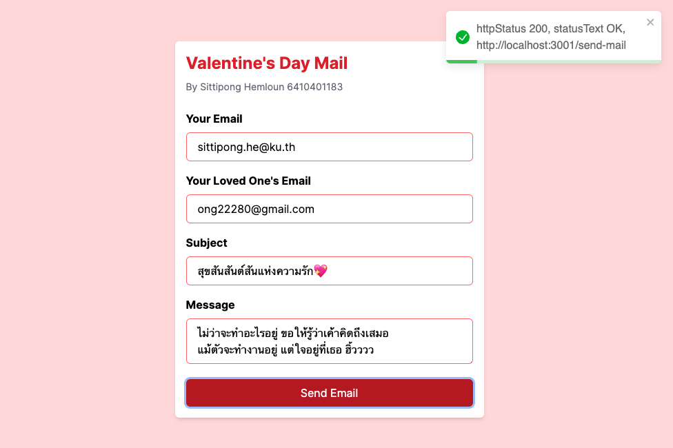
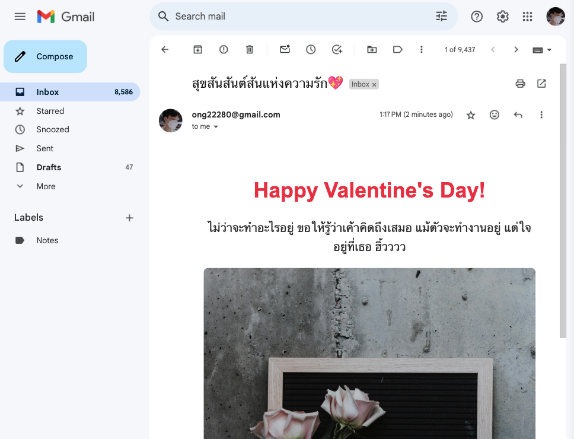
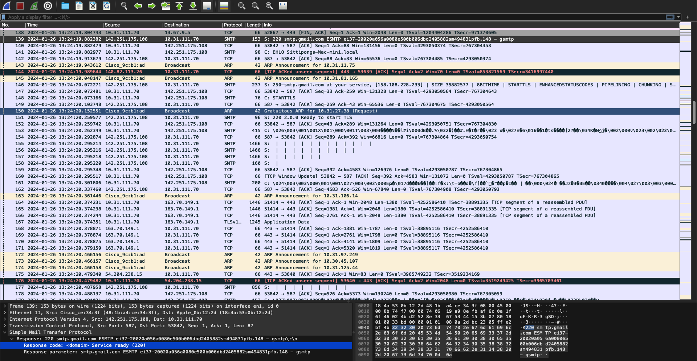

# Valentine&apos;s Day Mail

สิทธิพงค์ เหมล้วน 6410401183





## วัตถุประสงค์ของโปรแกรม

เพื่อบอกรักแฟนผ่าน mail ที่สวยงามในวัน valentine และส่งความรักให้คนพิเศษที่เรารัก

## characteristics ของแอปพลิเคชัน

- สามารถส่งอีเมล์ได้โดยใส่ที่อยู่อีเมล์ของผู้ส่งและผู้รับ, หัวข้อเรื่อง และข้อความ
- แสดงข้อความแจ้งเตือนด้วย http status เมื่อส่งอีเมล์สำเร็จหรือไม่สำเร็จ

## การใช้งานของ Transport Layer

ใช้ Transport Layer แบบ TCP (Transmission Control Protocol) เนื่องจาก TCP มีความเสถียรและนิ่งที่สูง และเหมาะสมสำหรับการส่งข้อมูลแบบเชื่อมต่อที่ต้องการความเชื่อถือและความแม่นยำ
```javascript
// สร้าง Nodemailer transporter object พร้อมกับการกำหนดค่า SMTP
const transporter = nodemailer.createTransport({
  host: "smtp.gmail.com", // ใช้ Gmail SMTP server
  secure: false, // ไม่ต้องการ TLS/SSL
  ignoreTLS: false, // ไม่ต้องการเพิ่มโมดูล TLS
  auth: {
    user: "ong22280@gmail.com", // ที่อยู่อีเมลผู้ใช้ Gmail
    pass: process.env.GMAIL_APP_PASSWORD as string, // รหัสแอป Gmail ที่ได้รับจาก environment variables
  },
});

// ฟังก์ชันสำหรับส่งอีเมล โดยใช้ transporter
const sendMail = (
  mailOptions: nodemailer.SendMailOptions // ตัวเลือกการส่งอีเมลที่จะส่งไปยังฟังก์ชัน sendMail
): Promise<SentMessageInfo> => {
  // ส่ง Promise ที่ resolve กับข้อมูลข้อความที่ส่งไป หรือ reject ด้วยข้อผิดพลาด
  return new Promise((resolve, reject) => {
    // ใช้ transporter เพื่อส่งอีเมล ด้วย mailOptions ที่ให้ไว้
    transporter.sendMail(mailOptions, (error, info) => {
      if (error) {
        // หากเกิดข้อผิดพลาด  reject Promise ด้วย error object
        reject(error);
      } else {
        // หากสำเร็จ resolve Promise ด้วยข้อมูลข้อความที่ส่งไป
        resolve(info);
      }
    });
  });
};
```

## การออกแบบ Application-layer Protocol

- ใช้ `SMTP` ในการส่งอีเมล โดยใช้ Nodemailer เป็นโมดูลที่ใช้ส่งอีเมล และใช้ Gmail SMTP server เป็น SMTP server เนื่องจาก Gmail SMTP server มีความเสถียรและนิ่งที่สูง และเหมาะสมสำหรับการส่งข้อมูลแบบเชื่อมต่อที่ต้องการความเชื่อถือและความแม่นยำ
- ใช้ `DNS` ในการแปลงชื่อโดเมนเป็นที่อยู่ IP ของเซิร์ฟเวอร์ เนื่องจากโปรแกรมนี้ใช้ Gmail SMTP server ซึ่งมีที่อยู่ IP คงที่ และใช้ชื่อโดเมนเป็น smtp.gmail.com
- ใช้ `HTTP` ในการสื่อสารระหว่าง Client และ Server เนื่องจาก HTTP มีความเป็นสถานะ (stateless) และเป็นโปรโตคอลที่มีความเป็นที่นิยมในการสื่อสารระหว่าง Client และ Server ในปัจจุบัน

### รูปแบบข้อความ (Message Format)
  - **SEND_MAIL**: ข้อความสำหรับส่งอีเมล์ ประกอบด้วยข้อมูลเช่น ผู้ส่ง, ผู้รับ, หัวข้อเรื่อง, และข้อความ
    ```javascript
    class Mail {
      constructor(
        public from: string,
        public to: string,
        public subject: string,
        public message: string
      ) {}
    }
    ```

  - **NOTIFICATION**: ข้อความแจ้งเตือนการส่งอีเมล์สำเร็จหรือไม่สำเร็จ สถานะ (Status Code, Status Phrase)
    ```javascript
    try {
      const info = await sendMail(mailOptions);
      res.status(200).send("Email sent: " + info.response);
      console.log("Email sent: " + info.response);
    } catch (error: any) {
      console.error(error);
      res.status(500).send(error.toString());
    }
    ```

  
โปรโตคอลที่ออกแบบมาเพื่อใช้สื่อสารระหว่าง Client และ Server ในโปรแกรมนี้ชื่อ "SimpleMailProtocol"

## การใช้งาน
1. Clone repository
    ```bash
    git clone https://github.com/ong22280/simple-mail-wireshark.git
    ```
2. ติดตั้ง dependencies ของ client และ server
    ```bash
    cd simple-mail-wireshark/client
    npm install
    ```
    ```bash
    cd simple-mail-wireshark/server
    npm install
    ```
3. กำหนดค่าตัวแปร environment ในไฟล์ `.env`
    ```bash
    cd simple-mail-wireshark/server
    cp .env.example .env
    ```
    แก้ไขไฟล์ `.env` ให้ตรงกับของคุณ
    ```bash
    # .env
    GMAIL_APP_PASSWORD=your_gmail_app_password
    ```
4. เริ่มต้นแอปพลิเคชัน
    ```bash
    cd simple-mail-wireshark/server
    npm start
    ```
    ```bash
    cd simple-mail-wireshark/client
    npm run dev
    ```
5. เข้าถึงแอปพลิเคชันผ่าน URL: `http://localhost:3001`
